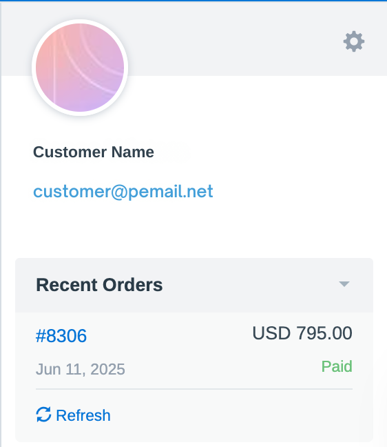
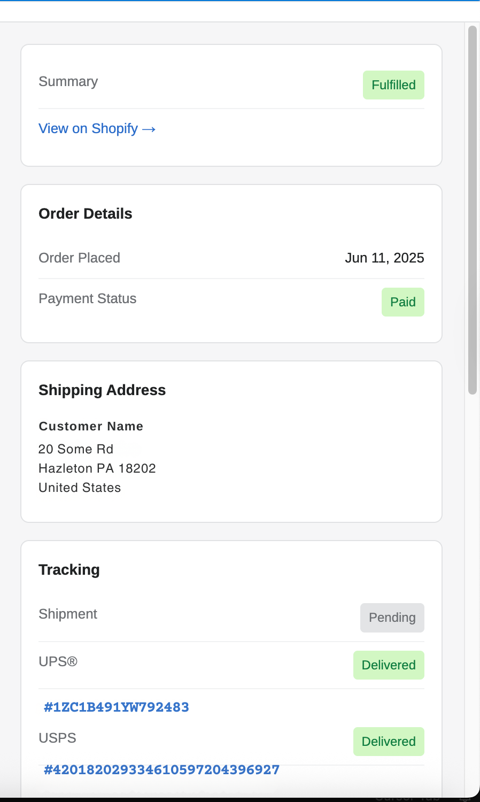
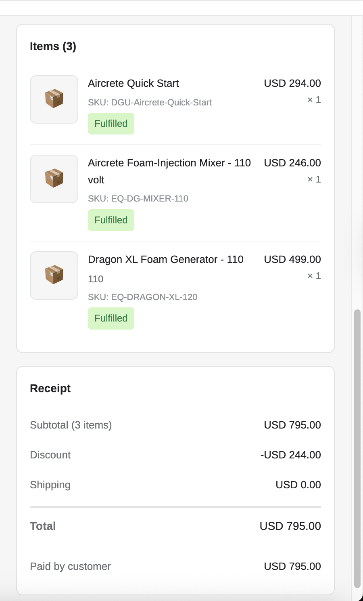

# FreeScout Shopify Integration Module

A FreeScout module that integrates with Shopify to display customer order history directly in the conversation sidebar, providing support teams with instant access to order information.


## Features

### 📦 Order Display
- **Recent Orders Widget**: Shows up to 5 most recent orders in the conversation sidebar
- **Slide-Out Panel**: Click any order to view comprehensive details in a beautiful slide-out panel
- **Order Information**:
  - Order number, date, and total
  - Payment and fulfillment status
  - Shipping address
  - Tracking numbers with clickable links
  - Line items with product names, SKUs, quantities, and prices
  - Receipt breakdown (subtotal, discounts, shipping, tax, total)

### ⚡ Performance Optimization
- **Customer ID Caching**: Stores Shopify customer IDs in the database to reduce API calls
  - First lookup: 2 API calls (customer search + orders fetch)
  - Subsequent lookups: 1 API call (orders fetch only)
- **Order Caching**: Orders cached for 60 minutes to minimize API usage
- **Efficient API Usage**: Only loads orders when viewing a conversation

### 🔧 Flexible Configuration
- **Two-Tier Settings**:
  - Global settings for all mailboxes
  - Per-mailbox overrides for different Shopify stores
- **Environment Variables**: Support for `.env` configuration

### 🎨 User Interface
- Clean, modern design matching Shopify's aesthetic
- Smooth slide-out animation for order details
- Status badges for payment and fulfillment
- Responsive layout
- Hover effects and visual feedback

## Requirements

- FreeScout 1.8.190 or higher
- PHP 7.3 or higher
- MySQL/MariaDB
- Shopify store with Admin API access

## Installation

### 1. Install the Module

```bash
cd /path/to/freescout/Modules
git clone https://github.com/Joelhaggar/freescout_module_shopify.git Shopify
cd Shopify
composer install
```

### 2. Run Migrations

```bash
php artisan migrate
```

This creates:
- `shopify` column in `mailboxes` table (for per-mailbox settings)
- `shopify_customer_id` column in `customers` table (for customer ID caching)

### 3. Enable the Module

```bash
php artisan module:enable "Shopify Integration"
```

### 4. Clear Caches

```bash
php artisan cache:clear
php artisan config:clear
php artisan view:clear
```

## Shopify Setup

### 1. Create a Custom App

1. Go to your Shopify Admin
2. Navigate to **Settings** → **Apps and sales channels** → **Develop apps**
3. Click **Create an app**
4. Give it a name (e.g., "FreeScout Integration")

### 2. Configure API Scopes

1. Click on your app
2. Go to **Configuration** tab
3. Under **Admin API integration**, click **Configure**
4. Enable these scopes:
   - `read_customers` - Required to search for customers by email
   - `read_orders` - Required to fetch customer orders
5. Click **Save**

### 3. Install the App

1. Click **Install app** button
2. Confirm the installation

### 4. Get Access Token

1. After installation, click **Reveal token once** to see your Admin API access token
2. **Copy this token** - it starts with `shpat_`
3. ⚠️ **Important**: You can only view this token once! Save it securely.

## Configuration

### Global Settings

Configure default settings for all mailboxes:

1. Go to **Settings** → **Shopify** in FreeScout
2. Enter:
   - **Shop Domain**: Your store's domain (e.g., `your-store.myshopify.com`)
   - **Access Token**: The Admin API access token from Shopify
   - **API Version**: The API version (e.g., `2025-01`)
3. Click **Save**

### Per-Mailbox Settings (Optional)

Override global settings for specific mailboxes:

1. Go to **Manage** → **Mailboxes**
2. Select a mailbox
3. Click **Shopify** in the left menu
4. Configure mailbox-specific settings
5. Click **Save**

### Environment Variables (Optional)

You can also configure via `.env`:

```env
SHOPIFY_SHOP_DOMAIN=your-store.myshopify.com
SHOPIFY_ACCESS_TOKEN=shpat_your_access_token_here
SHOPIFY_API_VERSION=2025-01
```

## Usage

### Viewing Orders

1. Open any conversation in FreeScout
2. Look for the **Recent Orders** section in the right sidebar
3. Orders are automatically loaded for the customer's email address

### Order Details Panel

1. Click on any order in the list
2. A slide-out panel opens from the right showing:
   - Order summary and status badges
   - Link to view order in Shopify admin
   - Order date and payment status
   - Full shipping address
   - Tracking information with clickable links
   - All line items with products, quantities, and prices
   - Complete receipt breakdown
3. Close the panel by:
   - Clicking the **X** button
   - Clicking the dark overlay
   - Pressing **ESC** key

### Refreshing Orders

Click the **Refresh** link below the order list to fetch the latest data from Shopify.

## Technical Details

### Architecture

- **Laravel Module System**: Uses FreeScout's module structure
- **Eventy Hooks**: WordPress-style action/filter system for integration
- **Service Provider Pattern**: Clean separation of concerns
- **REST API**: Uses Shopify Admin REST API (not GraphQL)

### API Endpoints Used

1. **Customer Search**: `/admin/api/{version}/customers/search.json?query=email:{email}`
2. **Customer Orders**: `/admin/api/{version}/customers/{customer_id}/orders.json?status=any&limit=5`

### Database Schema

**mailboxes.shopify** (TEXT, nullable)
```json
{
  "shop_domain": "store.myshopify.com",
  "access_token": "shpat_...",
  "api_version": "2025-01"
}
```

**customers.shopify_customer_id** (VARCHAR, nullable, indexed)
```
Stores Shopify customer ID for fast subsequent lookups
```

### Caching Strategy

- **Customer IDs**: Stored permanently in database
- **Orders**: Cached for 60 minutes in Laravel cache
- Cache keys:
  - Global: `shopify_orders_{email}`
  - Per-mailbox: `shopify_orders_{mailbox_id}_{email}`

## Development

### File Structure

```
Modules/Shopify/
├── Config/
│   └── config.php                  # Module configuration
├── Database/
│   └── Migrations/                 # Database migrations
├── Http/
│   ├── Controllers/
│   │   └── ShopifyController.php  # AJAX and settings controllers
│   └── routes.php                  # Module routes
├── Providers/
│   └── ShopifyServiceProvider.php # Main service provider with hooks
├── Public/
│   ├── css/
│   │   └── module.css             # Styles for widget and panel
│   └── js/
│       ├── laroute.js             # Route definitions
│       └── module.js              # Frontend functionality
├── Resources/
│   └── views/                     # Blade templates
├── composer.json
├── module.json
└── README.md
```

### Key Classes

**ShopifyServiceProvider**
- Registers hooks and event handlers
- API integration methods
- Settings management

**ShopifyController**
- Handles AJAX requests for order data
- Manages mailbox-specific settings

### Hooks

```php
// Settings menu integration
\Eventy::addAction('mailboxes.settings.menu', ...)

// Settings page
\Eventy::addFilter('settings.sections', ...)
\Eventy::addFilter('settings.section_params', ...)
\Eventy::addFilter('settings.section_settings', ...)

// Display widget in conversation sidebar
\Eventy::addAction('conversation.after_prev_convs', ...)

// Customer menu item
\Eventy::addAction('conversation.customer.menu', ...)
```

## Troubleshooting

### Orders Not Loading

1. **Check API credentials**:
   - Verify shop domain format: `store.myshopify.com` (not `https://` or custom domain)
   - Ensure access token is correct
   - Check API version is valid (e.g., `2025-01`)

2. **Check API scopes**:
   - Confirm `read_customers` and `read_orders` scopes are enabled
   - Re-install the Shopify app if scopes were added later

3. **Check logs**:
   ```bash
   tail -f storage/logs/laravel.log | grep Shopify
   ```

### Widget Not Appearing

1. **Module enabled?**
   ```bash
   php artisan module:list | grep Shopify
   ```

2. **Clear caches**:
   ```bash
   php artisan cache:clear
   php artisan view:clear
   ```

3. **Check customer email**: Orders only appear if the customer's email matches a Shopify customer

### API Rate Limits

Shopify REST API limits:
- **Shopify Plus**: 2 requests/second
- **Other plans**: 2 requests/second

The module's caching strategy minimizes API calls to stay well within limits.

## Changelog

### Version 1.0.0 (2025-10-24)
- Initial release
- Customer order history display
- Slide-out panel for order details
- Customer ID caching optimization
- Per-mailbox configuration support
- Order caching (60 minutes)

## Credits

- **Original Concept**: Based on FreeScout's WooCommerce Integration module
- **Developed by**: Joel Haggar
- **Built with**: [Claude Code](https://claude.com/claude-code)

## License

AGPL-3.0

## Support

For issues, questions, or contributions, please visit:
https://github.com/Joelhaggar/freescout_module_shopify

## Screenshots

### Order List in Sidebar
Orders appear automatically when viewing a conversation with a Shopify customer.



### Order Details Panel
Click any order to view comprehensive details in a beautiful slide-out panel with:
- Order status and fulfillment badges
- Shipping address and tracking
- Product line items
- Complete receipt breakdown





---

**Note**: This module is not officially affiliated with Shopify or FreeScout.
